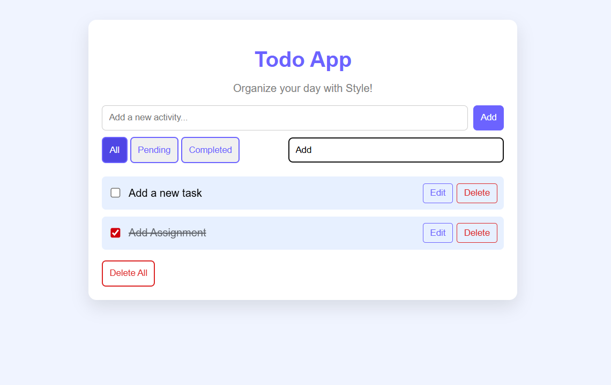

## Todo App Assignment

A simple and clean **Todo App** built using **HTML, CSS, and JavaScript** — no frameworks, no libraries. Designed to help you manage tasks easily with features like **add**, **edit**, **delete**, **complete**, **filter**, and **search**.

### Features

- Add new todos
- Edit existing todos
- Delete individual todos
- Delete all todos
- Mark todos as completed using checkboxes
- Real-time search through todos
- Filter todos: `All`, `Pending`, `Completed`
- Custom styled buttons, active states, and hover effects
- Built with clean JavaScript using modern methods like:
- `map()`, `filter()`, `splice()`, `spread operator`, etc.

### ScreenShots
- Home 

- Todo list (All)

- Pending Todos

- Completed Todos

- Search Todos as per keyword

- Edit Todos
