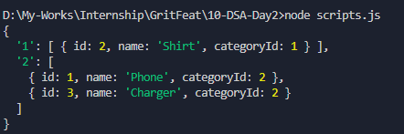
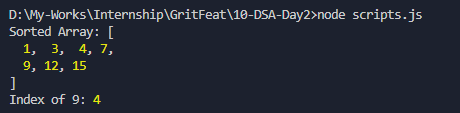
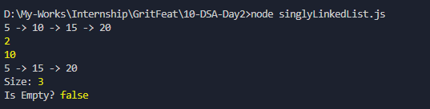
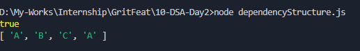

# DSA Day 2 Assignment

#### `List`, `Linked List`, `Hash Table`, `Algorithms`, `Binary Search Tree`

---

## Solve these problems and calculate the time complexity.

### 1. Find if a duplicate exists in a list of numbers.
**Code:**
```js
function findDuplicates(arr) {
    const counts = {};
    const duplicates = new Set();

    for (const num of arr) {
        if (counts[num]) {
            duplicates.add(num);
        }
        else {
            counts[num] = 1;
        }
    }

    return Array.from(duplicates);
}

const data = [1, 3, 5, 2, 4, 5];
console.log(findDuplicates(data));    // [ 5 ]
```
**Time Complexity:** `O(n)` - linear time based on the size of the input array.

<br>


### 2. Check if any item from user roles exists in required roles.
**Code:**
```js
function hasRequiredRole(userRoles, requiredRoles) {
    const requiredSet = new Set(requiredRoles);

    for (const role of userRoles) {
        if (requiredSet.has(role)) {
            return true;
        }
    }

    return false;
}

const roles = ['admin', 'manager', 'supervisor', 'editor', 'viewer', 'owner', ''];
const userRoles = ['user', 'editor'];
const requiredRoles = ['admin', 'editor'];

console.log(hasRequiredRole(userRoles, requiredRoles));    // true
```
**Time Complexity:** `O(n + m)`
- Building the Set: O(n), where n = `requiredRoles.length`
- Loop through userRoles: O(m), where m = `userRoles.length`
- Total: O(n + m)


<br>


### 3. Find Common Elements Between Two Arrays
**Code:**
```js
function commonElements(arr1, arr2) {
    const setB = new Set(arr2);
    const result = [];

    for (const item of arr1) {
        if (setB.has(item)) {
            result.push(item);
        }
    }
    return result;
}

const a1 =  [1,4,2,8,9];
const a2 = [7,5,0,4,1];

console.log(commonElements(a1, a2));   // [ 1, 4 ]
```

**Time Complexity:** `O(n + m)`
- Build set from arr2: O(n)
- Iterate arr1: O(m)
- Set lookup per item: O(1) avg
- Total time: O(n + m)


<br>


### 4. Filter items based on allowed keys
**Code:**
```js
function filterByAllowedKeys(data, allowedKeys) {
    const allowedSet = new Set(allowedKeys);

    return data.filter((item) => {
        return allowedSet.has(item.key)
    });
}
const data = [
  { key: 'name', value: 'John' },
  { key: 'email', value: 'john@example.com' },
  { key: 'age', value: 20 },
];

const allowedKeys = ['name', 'age'];

console.log(filterByAllowedKeys(data, allowedKeys));    // [ { key: 'name', value: 'John' }, { key: 'age', value: 20 } ]
```

**Time Complexity:** `O(n + k)`
- Building the Set: O(k), where k = allowedKeys.length
- Filtering: O(n), where n = data.length
- Each .has() check: O(1)
- Total: O(n + k)


<br>


### 5. Determine whether both keys and values  of two objects are equal 
**Code:**
```js
function sameObject(obj1, obj2) {
    const keys1 = Object.keys(obj1);
    const keys2 = Object.keys(obj2);

    if (keys1.length !== keys2.length) {
        return false;
    }

    for (const key of keys1) {
        if (!(key in obj2)) {
            return false;
        }
        if (obj1[key] !== obj2[key]) {
            return false;
        }
    }
    return true;
}

const d1 = { name: 'John', email: 'john@example.com', age: 20 };
const d2 = { name: 'John', email: 'john@example.com', age: 20 };
const d3 = { name: 'Jane', email: 'jane@example.com', age: 20 };

console.log(sameObject(d1, d2)); // true
console.log(sameObject(d1, d3)); // false
```

**Time Complexity:** `O(n)`
- Object.keys: O(n)
- Loop through keys: O(n)
- Total Time: O(n), where n is the number of keys in the objects.


<br>


### 6. Group the related data by category 
**Code:**
```js
function groupByCategory(products) {
    const grouped = {};

    for (const product of products) {
        const key = product.categoryId;

        if (!grouped[key]) {
            grouped[key] = [];
        }

        grouped[key].push(product);
    }
    return grouped;
}

const products = [
  { id: 1, name: 'Phone', categoryId: 2 },
  { id: 2, name: 'Shirt', categoryId: 1 },
  { id: 3, name: 'Charger', categoryId: 2 }
];

console.log(groupByCategory(products));

```

**Output:**



**Time Complexity:** `O(n)` - O(n) iterations


<br>


### 7. Implement binary search algorithm. (If sorting is required, you should use one of the sorting algorithms: Selection, Insertion, Merge, Quick, Heap Sort)

- Binary Search with Insertion Sort

**Code:**
```js
function insertionSort(arr) {
  for (let i = 1; i < arr.length; i++) {
    let key = arr[i];
    let j = i - 1;

    while (j >= 0 && arr[j] > key) {
      arr[j + 1] = arr[j];
      j--;
    }

    arr[j + 1] = key;
  }
  return arr;
}

function binarySearch(arr, target) {
  let left = 0;
  let right = arr.length - 1;

  while (left <= right) {
    let mid = Math.floor((left + right) / 2);

    if (arr[mid] === target) {
      return mid;
    } else if (arr[mid] < target) {
      left = mid + 1;
    } else {
      right = mid - 1;
    }
  }

  return -1; 
}


const inputArray = [12, 4, 7, 9, 1, 15, 3];
const sortedArray = insertionSort([...inputArray]); // Clone input array to avoid mutation
const target = 9;

const index = binarySearch(sortedArray, target);

console.log("Sorted Array:", sortedArray);
console.log(`Index of ${target}:`, index);
```

**Output:**



<br>


### 8. Implement singly linked list. Operations on the linked list should be:
- Append: Add data at the end
- Prepend: Add data at  the beginning
- RemoveAt: Removes data from the given index
- InsertAt: Add data at the given index
- Size: returns the size of list
- isEmpty: Checks if list is empty or not
- Search: Finds data from linked list.

**Output:**




<br>


### 9. Function to detect whether the dependency structure contains any cycles, where an item indirectly or directly depends on itself.(optional)

**Output:**




<br>


### 10.Explain the concept of a Binary Search Tree and provide its implementation in JavaScript.

A Binary Search Tree is a binary tree where:
- Each node has at most two children: `left` and `right`.
- For any node:
    - All values in the left subtree are **less than** the node’s value.
    - All values in the right subtree are **greater than** the node’s value.

This makes `searching`, `insertion`, and `deletion` efficient — ideally `O(log n)` time if balanced.

**BST Implementation:**
```js
class Node {
  constructor(value) {
    this.value = value;
    this.left = null;
    this.right = null;
  }
}

class BST {
  constructor() {
    this.root = null;
  }

  insert(value) {
    const newNode = new Node(value);
    if (!this.root) return this.root = newNode;

    let current = this.root;
    while (true) {
      if (value === current.value) return; // avoid duplicates
      if (value < current.value) {
        if (!current.left) return current.left = newNode;
        current = current.left;
      } else {
        if (!current.right) return current.right = newNode;
        current = current.right;
      }
    }
  }

  search(value) {
    let current = this.root;
    while (current) {
      if (value === current.value) return true;
      current = value < current.value ? current.left : current.right;
    }
    return false;
  }
}

const tree = new BST();
tree.insert(10);
tree.insert(5);
tree.insert(15);

console.log(tree.search(5));   // true
console.log(tree.search(12));  // false 

```