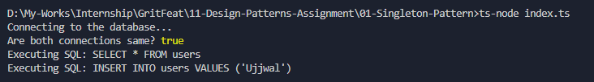

# Singleton Pattern

## Purpose
Ensures that only one instance of a class is created throughout the lifetime of an application.

## How it Works
- The constructor is private, preventing direct instantiation.
- `getInstance()` checks if an instance exists.
  - If not, creates it.
  - If yes, returns the existing one.
- Guarantees the same object is reused.

## Output

