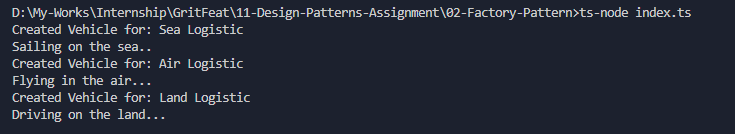

# Factory Pattern - LogisticsFactory

## Purpose
The Factory Pattern is used to create objects without exposing the creation logic to the client and refers to the newly created objects using a common interface.

## How it works
- We define an interface `Vehicle` with a method `drive()`.
- We implement concrete classes `Ship`, `Plane`, and `Truck` that follow the `Vehicle` interface.
- The `LogisticsFactory` has a static method `createVehicle` which takes a string describing the logistic type and returns the appropriate vehicle instance.
- The client code (`index.ts`) uses the factory to get vehicle instances and calls their `drive` method without knowing the creation details.

## Output

