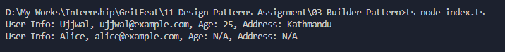

# Builder Pattern - UserBuilder

## Purpose
The Builder Pattern allows step-by-step construction of complex objects, separating the construction logic from the representation.

## How it works
- The `UserBuilder` class provides methods to set required and optional fields.
- The `build()` method validates the required fields and returns the constructed `User` object.
- The client uses the builder to set fields fluently and then build the final object.

## Output

