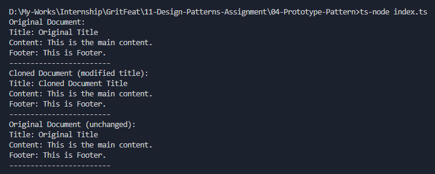

# Prototype Pattern - DocumentTemplate

## Purpose
The Prototype Pattern is used to create new objects by copying existing ones, avoiding reinitialization from scratch.

## How it works
- `DocumentTemplate` has fields: `title`, `content`, `footer`.
- The `clone()` method returns a new `DocumentTemplate` with the same property values.
- The client can modify the cloned object without affecting the original.

## Output

