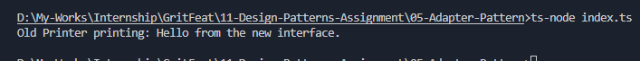

# Adapter Pattern - OldPrinterAdapter

## Purpose
The Adapter Pattern allows incompatible interfaces to work together by translating calls from one interface to another.

## Scenario
- We have an `OldPrinter` class with `printText(text)` method.
- The new application expects `print(message)` method.
- We create an `OldPrinterAdapter` that implements the new `NewPrinter` interface and internally calls the old `printText()` method.

## Output

