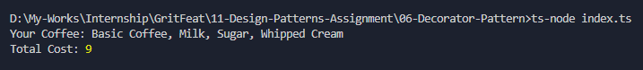

# Decorator Pattern - Coffee Customization

## Purpose
The Decorator Pattern allows behavior to be added to individual objects, dynamically, without modifying their class.

## How it works
- `Coffee` is the main interface with `cost()` and `description()` methods.
- `BasicCoffee` is the core implementation.
- Decorators (`Milk`, `Sugar`, `WhippedCream`) wrap around the base coffee and add their own cost and description.
- You can layer multiple decorators in any order to create custom drinks.

## Output

