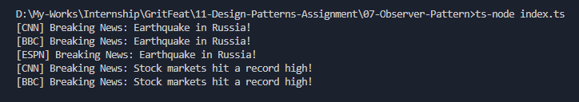

# Observer Pattern - News Agency Example

## Purpose
The Observer Pattern allows an object (subject) to notify multiple dependents (observers) automatically when its state changes.

## How it works
- `Observer` interface defines `update(news)` for subscribers.
- `NewsChannel` implements `Observer` and displays the news.
- `NewsAgency` implements `Subject` and maintains a list of observers.
- When `publishNews()` is called, all observers get updated.

## Output

