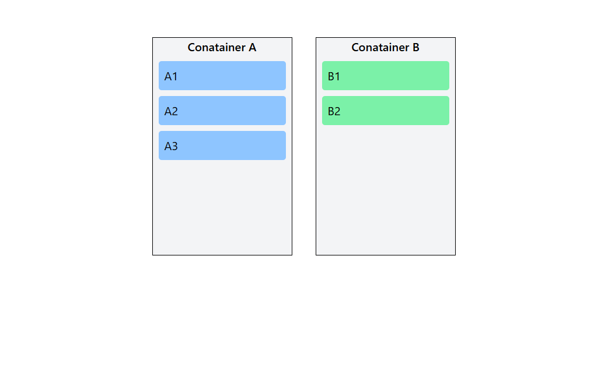
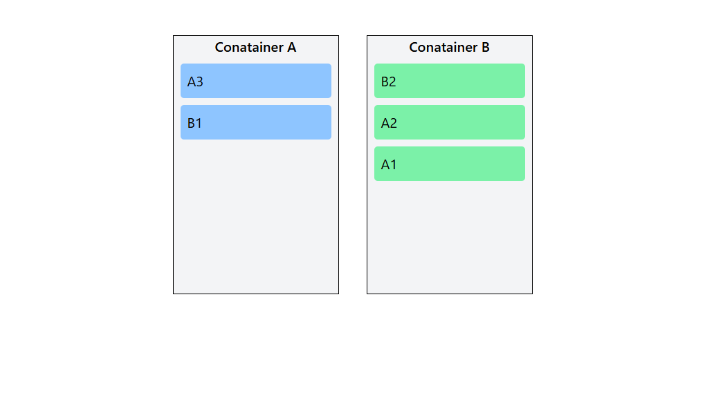

# React Drag and Drop Demo

A simple **drag-and-drop demo** built with **React** and **TypeScript**. This project demonstrates how to move items between two containers dynamically using React state and the HTML5 Drag and Drop API.

---

## Demo

- Before dragging

- After dragging

Try dragging items from **Container A** to **Container B** and vice versa. Items will be removed from the source and added to the target dynamically.

---

## Features

- Drag and drop items between two containers.
- State management with **React Hooks (`useState`)**.
- Dynamic rendering of items after drag-and-drop.
- Fully styled using **Tailwind CSS**.
- Easy to extend to multiple containers or items.

---

## Technologies

- **React** (with TypeScript)
- **Tailwind CSS**
- **HTML5 Drag and Drop API**
- **Vite** 

---

