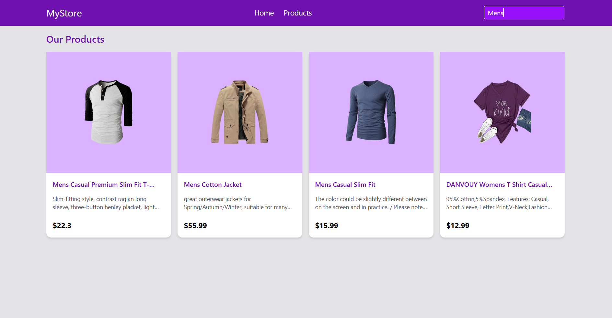

# Product Listing App

A small React application that lists products, allows searching, and displays product details using **React Router**. Built with **TypeScript**, **Tailwind CSS**, and **React Hooks**.

---

## Features

- **Home Page** (`/`)
  - Welcome message
  - Navigation link to Products page

- **Products Page** (`/products`)
  - Fetches products from [Fake Store API](https://fakestoreapi.com/products)
  - Displays products in a responsive grid
  - Search bar filters products in real-time
  - Click on a product to view details

- **Product Details Page** (`/products/:productId`)
  - Displays detailed information about a selected product
  - Shows product image, title, category, description, and price
  - Handles loading and "product not found" states

---

## Technologies Used

- **React** (with TypeScript)
- **Tailwind CSS** for styling
- **React Router Dom** for routing
- **React Hooks**: `useState`, `useEffect`, `useParams`, `useNavigate`
- **Fetch API** for retrieving product data

---

## Project Structure

```
src/
├─ pages/
│ ├─ Home.tsx
│ ├─ Products.tsx
│ └─ ProductDetails.tsx
├─ App.tsx
└─ main.tsx
```

- `Home.tsx` – Landing page with welcome message and navigation.
- `Products.tsx` – Displays product list with search filter and clickable cards.
- `ProductDetails.tsx` – Shows individual product details based on `productId`.
- `App.tsx` – Contains all routes.
- `main.tsx` – Entry point rendering `App` inside `BrowserRouter`.

---

## ScreenShots

- Home Page


- Products Page


- Searching a Product




---

## Usage

1. Clone the repository:

```bash
git clone https://github.com/uzwal01/gritfeat-assignments/tree/main/13-React-Assignment-Product-Listing-App/product-listing-app
cd product-listing-app
```

2. Install dependencies:

```bash
npm install

```

3. Start the development server:

```bash
npm run dev
```

4. Open your browser at `http://localhost:5173` to view the app.