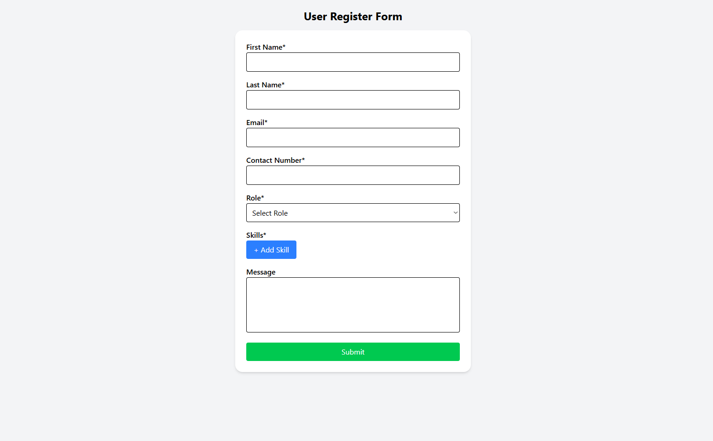
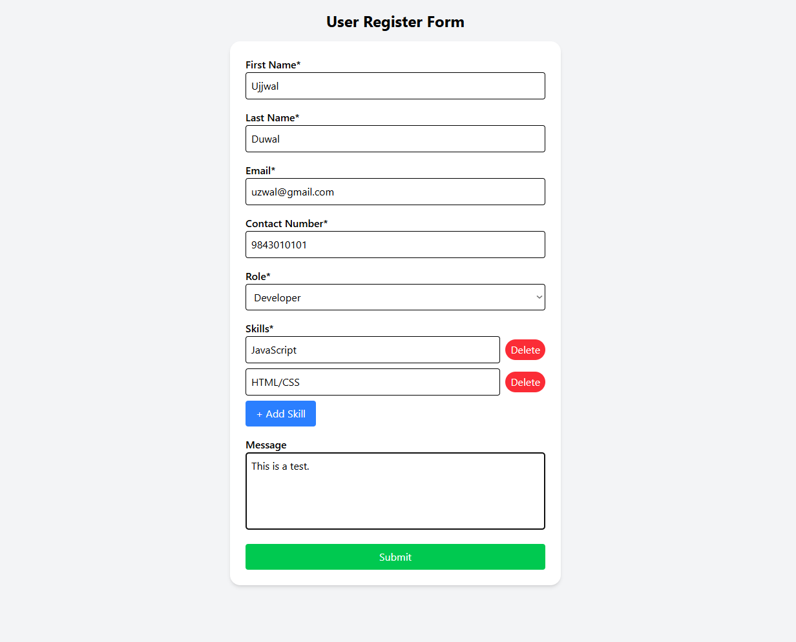
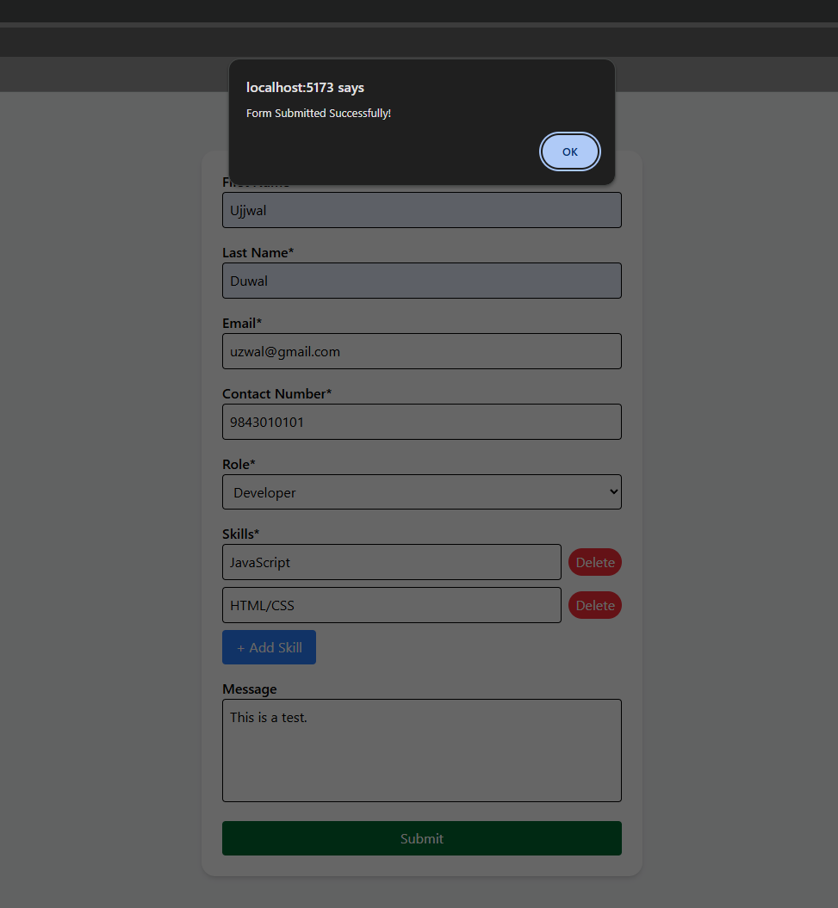
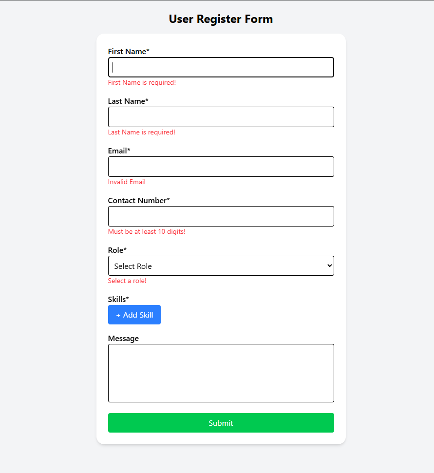
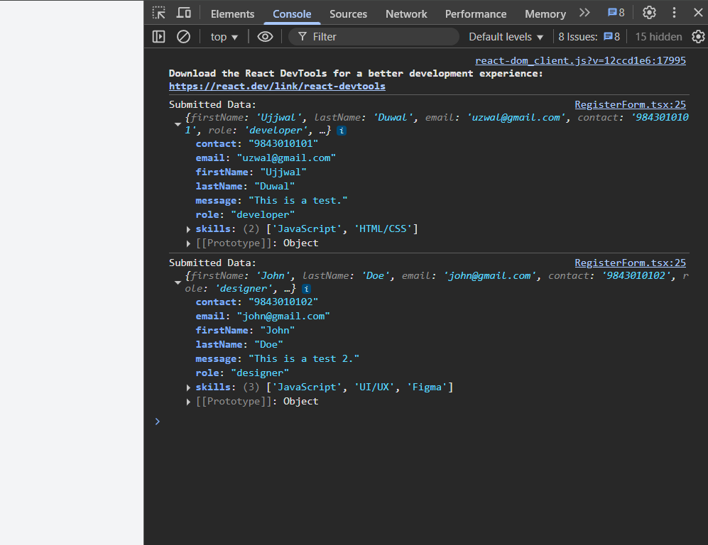

# React User Register Form

A user registration form built with **React**, **TypeScript**, **Vite**, **Tailwind CSS**, **React Hook Form**, and **Zod**.  
This project demonstrates schema-based validation, dynamic field arrays, and proper form handling.

---

## Features

- **Form Management:** Powered by [React Hook Form](https://react-hook-form.com/)  
- **Schema Validation:** Enforced using [Zod](https://zod.dev)  
- **Dynamic Fields:** Add or remove **skills** dynamically with at least one field by default  
- **Validation Rules:**
  - All fields except *Message* are required
  - Whitespace-only inputs are invalid
  - Email format validation
  - Contact number: must be at least 10 digits and contain only numbers
  - At least 1 skill required
- **Error Handling:** Inline dynamic error messages for each field  
- **Form Reset:** On successful submission, the form resets with default values  

---

## Project Structure

```bash
├── components/
│   └── RegisterForm.tsx      # Main form component
├── schemas/
│   └── registerSchema.ts     # Zod validation schema
├── App.tsx                   # Root component
├── main.tsx                  # React DOM entry
├── index.css                 # Tailwind base styles
└── ...
```

---

## Tech Stack

- React (with Vite) — Fast development and build tool
- Tailwind CSS — Utility-first styling
- TypeScript — Type safety
- React Hook Form — Lightweight form management
- Zod — Type-safe validation schemas


---

## ScreenShots

- Home


- User Registration


- Alert on successful submission


- Inline Dynamic Error Messages


- Registered users can be viewed in browser console

