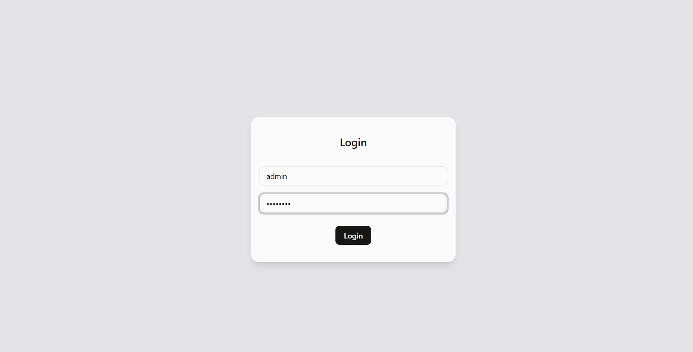
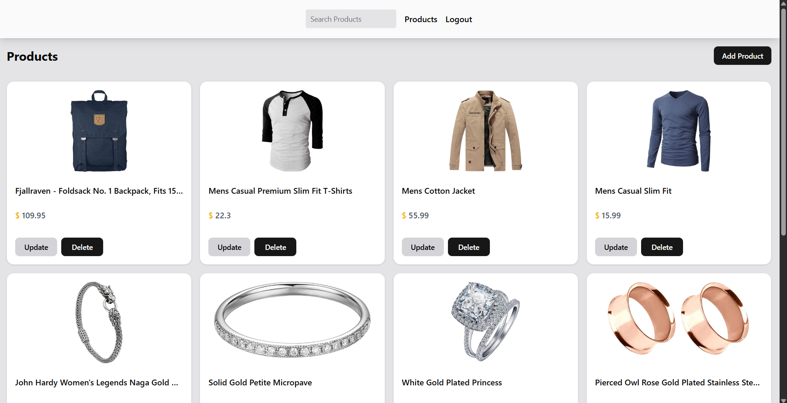
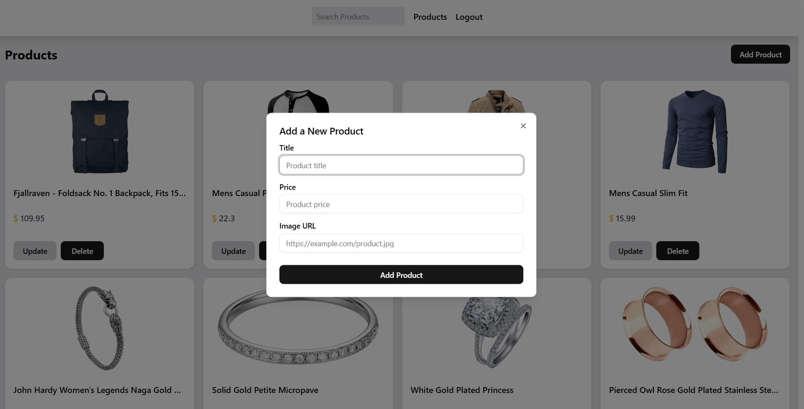
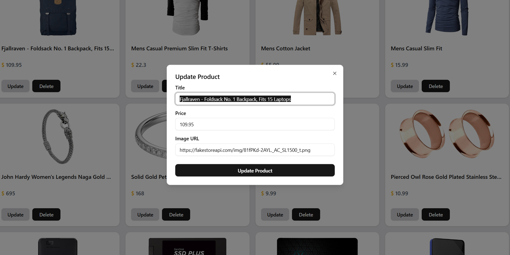

# React CRUD App (Login + Dashboard)

A simple **React + TypeScript** CRUD application that demonstrates:

- Login authentication (with hardcoded credentials)
- Product management (CRUD operations)
- Modern UI with **ShadCN UI**
- Data fetching & caching with **TanStack Query**
- Navigation using **React Router**
- Pagination, optimistic updates, and error/loading states

---

## Features

### Authentication
- Hardcoded credentials:
  - **Username**: `admin`
  - **Password**: `admin123`
- Redirects to Dashboard upon successful login.
- Error message for invalid credentials.

### Dashboard
- Fetches product data from [FakeStore API](https://fakestoreapi.com/).
- Displays products in styled cards.
- Search Filtering.
- **CRUD Operations:**
  - **Create**: Add a new product via a popup form (title, price, image).
  - **Read**: View all products in a paginated grid.
  - **Update**: (WIP) Update product info via popup form.
  - **Delete**: Remove a product with optimistic UI updates.
- **Pagination**: Navigate between pages.
- **Loading/Error States**: Handled gracefully with ShadCN components.

---

## Tech Stack

- **React + TypeScript** → Component-based architecture with type safety
- **ShadCN UI** → Pre-styled Tailwind + Radix UI components
- **TanStack Query** → Data fetching, caching, and mutations
- **React Router** → Page navigation
- **Tailwind CSS** → Utility-first styling

---

## Installation & Setup

Clone this repository:

```bash
git clone https://github.com/uzwal01/gritfeat-assignments/tree/main/15-React-Shadcn/CRUD-dashboard
cd react-crud-app
```

Install Dependencies:

```bash
npm install
```

Start the development server:

```bash
npm run dev
```

---

## Usage

1. Navigate to the Login page (/).
2. Enter:
    - Username: admin
    - Password: admin123
3. After login, you’ll be redirected to the Dashboard.
4. From the Dashboard, you can:
    - View products
    - Add a new product (via popup form)
    - Delete products
    - Navigate through pages

---

## Screenshots

- Login Page


- Product List Dashboard


- Add Product Dialog


- Update Product



---

## Notes

- The FakeStore API does not persist Create/Update/Delete operations.
    - New products will appear temporarily but reset on page refresh.

- This project is for learning/demo purposes only.