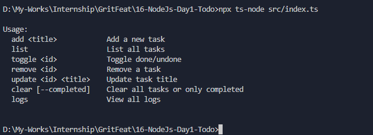
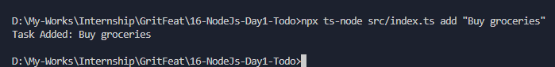
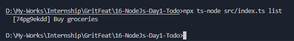
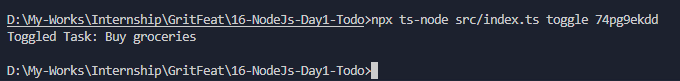
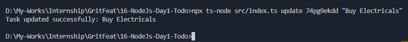
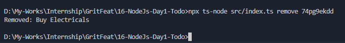
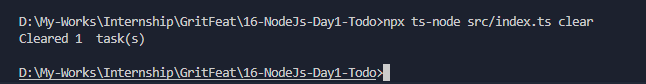
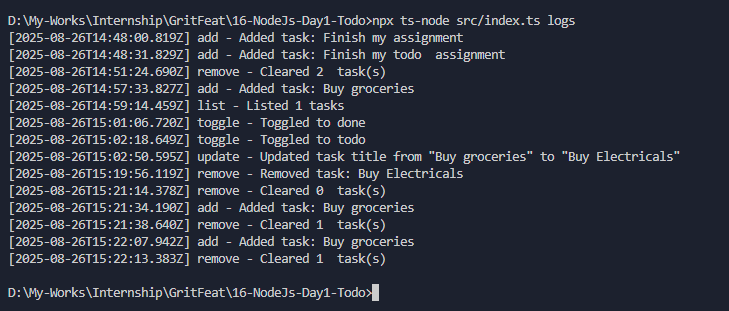
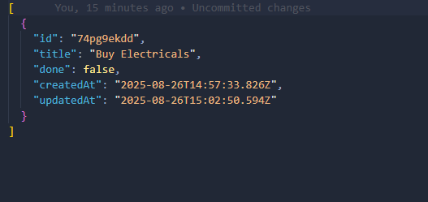
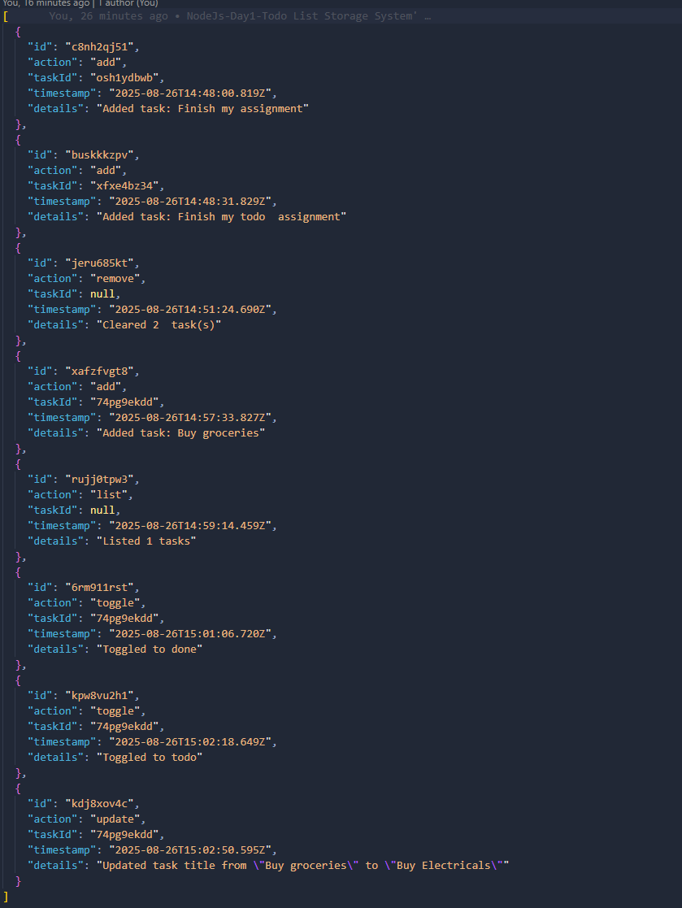

# Todo List Storage System CLI - Node.js + TypeScript

A simple command-line Todo List application built with **Node.js** and **TypeScript**.  
Tasks are stored in a JSON file, and every action is logged to a separate JSON file.

---

## Features

- **Add Task** – Add a new task with a title.  
- **List Tasks** – Display all tasks with status and ID.  
- **Update Task** – Edit a task's title.  
- **Toggle Task** – Mark a task as done/undone.  
- **Remove Task** – Delete a task by ID.  
- **Clear Tasks** – Remove all tasks or only completed tasks.  
- **View Logs** – View a history of all actions performed.

Each task includes:  

- `id` – Unique identifier  
- `title` – Task description  
- `done` – Boolean indicating completion  
- `createdAt` – Timestamp when created  
- `updatedAt` – Timestamp when last updated  

Each log entry includes:  

- `id` – Unique log ID  
- `action` – Action performed (add, update, toggle, remove, clear, list)  
- `taskId` – Related task’s ID (if applicable)  
- `timestamp` – When the action happened  
- `details` – Additional information  

---

## Installation

1. Clone the repository:

```bash
git clone https://github.com/uzwal01/gritfeat-assignments/tree/main/16-NodeJs-Day1-Todo
```

2. Install dependencie

```
npm install
```

3. Run commands using `ts-node`:
```
npx ts-node src/index.ts <command>
```

---

## Usage

#### Usage Instruction

#### Add a task
```
npx ts-node src/index.ts add "Buy groceries"
```


#### List all Tasks
```
npx ts-node src/index.ts list
```


#### Toggle task completion
```
npx ts-node src/index.ts toggle <TASK_ID>
```


#### Update task title
```
npx ts-node src/index.ts update <TASK_ID> "New task title"
```


#### Remove a task
```
npx ts-node src/index.ts remove <TASK_ID>
```


#### Clear tasks
```
# Clear all tasks
npx ts-node src/index.ts clear

# Clear only completed tasks
npx ts-node src/index.ts clear --completed
```


#### View logs
```
npx ts-node src/index.ts logs
```


#### In `todos.json` file


#### In `logs.json` file



---

## Project Structure
```pgsql
todo-cli/
├─ data/
│  ├─ todos.json
│  └─ logs.json
├─ src/
│  ├─ types.ts        # Task and log type definitions
│  ├─ utils.ts        # JSON read/write helpers
│  ├─ todo.ts         # Task operations and logging
│  └─ index.ts        # CLI entry point with switch commands
├─ package.json
└─ tsconfig.json
```