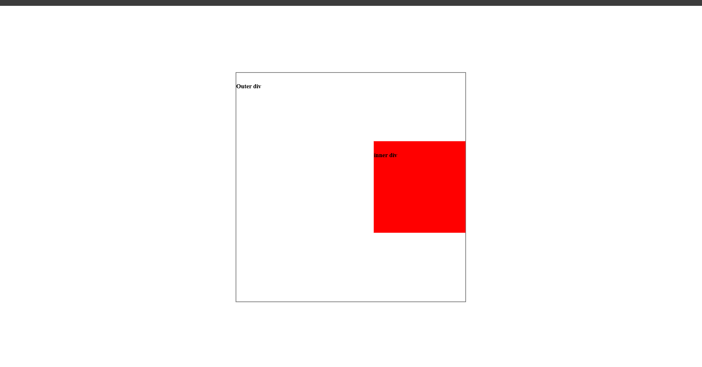

# CSS Position Task

## Objective
- To understand and apply different CSS position properties

## Topics Covered
- CSS Box Model (briefly)
- positioning Elements like; `Relative`, `Absolute`, `Fixed`

## ScreenShots
