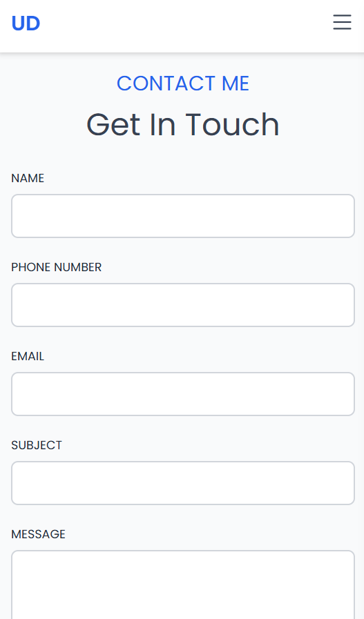

# Personal Portfolio Website

This is a simple, responsive **personal portfolio website** built using **HTML** and **Tailwind CSS**.  
The project showcases a mobile-friendly navbar with a pure CSS toggle menu.

---

## Features

- Single-page layout with sections: About, Skills, Projects, Contact
- Responsive design using Tailwind CSS utilities
- Mobile-first approach with hamburger menu toggling a slide-in sidebar
- Learning CSS-only menu toggle using hidden checkbox and Tailwind's `peer` utilities
- Bootstrap Icons used for hamburger and close icons

---

## Setup & Usage

1. Clone this repository:

   ```bash
   git clone https://github.com/your-username/your-repo-name.git

2. Open the index.html file in your preferred browser.

3. Customize content, styles, and sections as needed.

---

## Screenshots

- Home Section


- About Section


- Skills Section


- Projects Section


- Contact Section


---

- Mobile Responsives





