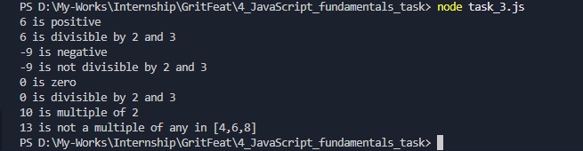
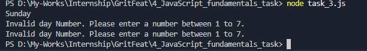
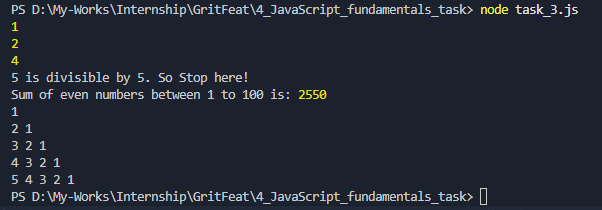
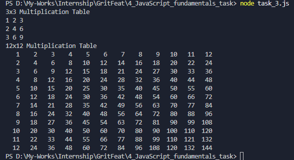
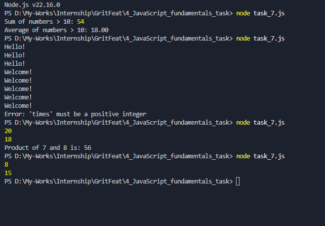
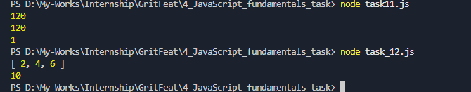

# JS Fundamentals Assignment

- Results/Outputs of task 1 and task 2 are commented in each line of code.
- Screenshots of Ouputs of task 3 to 12 are presented below;

---

## ScreenShots

- task 3

- task 4

- task 5

- task 6

- task 7, 8, 9 and 10

- task 11 and 12

---