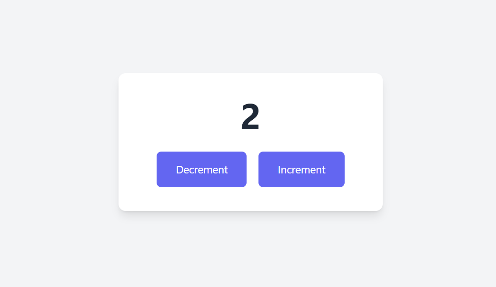
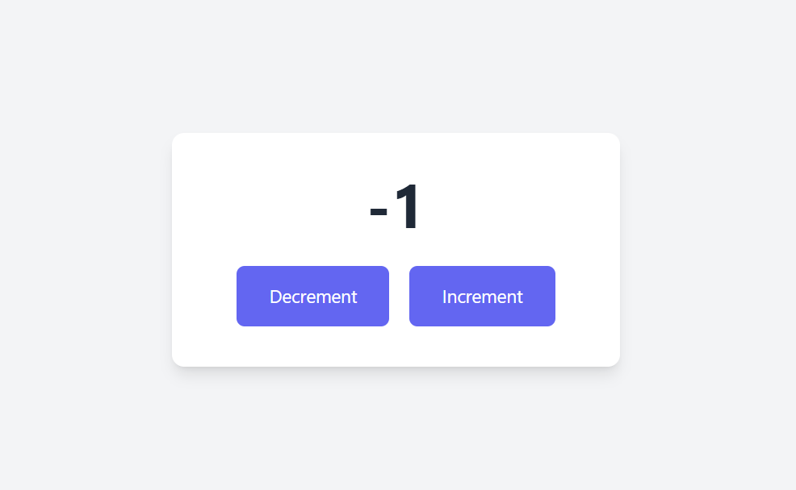

### 1. What will this code log? Explain your REASONing.

```js
const person = {
  name: "Alice",
  sayHi: function () {
    console.log(`Hi, my name is ${this.name}.`);
  },
};
person.sayHi();
```

**_OUTPUT:_** `Hi, my name is Alice.`

**_REASON:_** This method is invoked using `person.sayHi()`, so `this` refers to the `person` object where `this,name` becomes `Alice`.

---

### 2. What is logged to the console, and why? How would you fix it so it logs "Alice"?

```js
const person = {
  name: "Alice",
  greet: function () {
    console.log(`Hello, ${this.name}`);
  },
};
const greetFunction = person.greet;
greetFunction();
```

**_OUTPUT:_** `Hello, undefined`

**_REASON:_**

- Logs undefined because `this` depends on how the function is called, not where it was defined.
- In `person.greet();`, `this` points to person, so `this.name` is `ALice`.
- But When we do:

```js
const greetFunction = person.greet;
greetFunction();
```

Now we're calling greetFunction() on its own — not through person.
So JavaScript doesn’t know what this should point to.

- In strict mode, this becomes undefined.
- In non-strict (sloppy) mode, it becomes the global object (which doesn't have .name).

That’s why we get undefined.

**_How to fix?_**

- We use `.bind(person)` so `this` stays locked to person.

```js
const greetFunction = person.greet.bind(person);
greetFunction(); // Hello, Alice
```

---

### 3. What will this code log and why?

```js
const user = {
  name: "Bob",
  logName: function () {
    setTimeout(() => {
      console.log(this.name);
    }, 100); // Added 100 milliseconds(0.1s) delay
  },
};
user.logName();
```

**_OUTPUT:_** `Bob`

**_REASON:_**

- Regular functions (like `function() {}`) get their own this, based on how they're called. But Arrow functions don’t get their own `this`. They inherit `this` from the place they were defined.
- Here, the arrow function is defined inside `logName()`. `logName()` was called as `user.logName()`. So `this` inside `logName()` points to `user`. And since the arrow function inherits `this`, it also points to `user`. Therefore, Result: `this.name` is `"Bob"`.

---

### 4. You have a User object with a method that logs a welcome message. There's also a "Login" button in your HTML. You want the welcome method to be called when the button is clicked, and the message should use the User object's data.

```js
const User = {
  name: "Alice",
  welcome: function () {
    console.log(`Welcome, ${this.name}!`);
  },
};
// Hint: DOM APIs can be used
```

We can use:

```js
document
  .getElementById("loginBtn")
  .addEventListener("click", User.welcome.bind(User));
```

**_REASON:_**
We use `bind(User)` to ensure `this` remains bound to `User`. Otherwise, `this` would be the button element.

---

### 5. What will be logged to the console? Explain!

```js
let animal = "Cat";
function showAnimal() {
  let animal = "Dog";
  console.log(animal);
}
showAnimal();
console.log(animal);
```

**_OUTPUT:_**
`Dog`
`Cat`

**_REASON:_** `animal` inside `showAnimal` is a separate local variable due to block scoping via `let`.

---

### 6. What will this code output? Why?
```js
function test() {
  console.log(a);
  console.log(foo());
  var a = 1;
  function foo() {
    return 2;
  }
}
test();
```
**_OUTPUT:_**
`Undefined`
`2`

**_REASON:_**
- Hoisting is JavaScript's behavior of moving declarations to the top of their scope before code runs.
- `var a` is hoisted but not assigned yet so initialized as `undefined`.
- `foo()` is hoisted entirely (function declarations are hoisted with their body). Therefore, it logs `2`.


---

### 7. Explain the output of this for loop.
```js
for (var i = 0; i < 5; i++) {
  setTimeout(function() {
    console.log(i);
  }, 10);
}
```
**_OUTPUT:_** `5 5 5 5 5`

**_REASON:_** `var` is function-scoped. By the time `setTimeout` runs, loop is done and `i = 5`(In loop, when `i` reaches `5`, meets incorrect loop condition and loop fails i.e. `i` stops at `5`, so `i = 5`).


---

### 8. What will the following code log to the console on the last two lines? Explain why the count variable is not reset.
```js
function createCounter() {
  let count = 0;
  return function() {
    count++;
    console.log(count);
  };
}
const counter = createCounter();
counter();
counter();
```

**_OUTPUT:_** `1` `2`

**_REASON:_** 
- A ***closure*** happens when an inner function "remembers" variables from its outer function, even after the outer function has finished executing.
- Here, `count` isn't reset because the inner function forms a closure, which keeps a persistent reference to the `count` variable defined in `createCounter()`. Since we're calling the same closure (`counter()`), it remembers and updates the same count value across calls.


---

### 9. What does this code log? Explain!
```js
const myObject = {
  id: 'my-object',
  createLogger: function() {
    return () => {
      console.log(`Logger for ${this.id}`);
    };
  }
};
const logger = myObject.createLogger();
logger();
```

**_OUTPUT:_** `Logger for my-object`

**_REASON:_** 
- In JavaScript, arrow functions use lexical `this`, meaning: They capture `this` from the surrounding scope (where the function was defined), not from where it's called.
- The arrow function logs `"Logger for my-object"` because it inherits `this` from `createLogger()`, where `this` refers to `myObject`. Arrow functions don’t have their own this, so they use the one from their defining scope.


---

### 10. Write a function makeAdder(x) that takes a number x and returns a new function. The new function should take a number y and return the sum x + y. Use a closure to achieve this.

**_CODE:_**
```js
function makeAdder(x) {
    return function(y) {
        return x + y;
    };
}

let add = makeAdder(5);
console.log(add(2));
```

**_OUTPUT:_** `7`


---

### 11. Implement a parent Animal and a child Dog relationship in two different ways:

- **_Using the Constructor/Prototype pattern:_**
```js
// Parent
function Animal() {}
Animal.prototype.eat = function() {
  console.log("Animal eats");
};

// Child
function Dog() {}
Dog.prototype = Object.create(Animal.prototype);
Dog.prototype.constructor = Dog;
Dog.prototype.bark = function() {
  console.log("Dog barks");
};

let d = new Dog();
d.eat(); 
d.bark(); 

```
**_OUTPUT:_** 
`Animal eats`
`Dog barks`


- **_Using the ES6 class syntax:_**
```js
class Animal {
    eat() {
        console.log("Animal eats.");
    }
}

class Dog extends Animal {
    bark() {
        console.log("Dog barks.");
    }
}

const dog = new Dog();
dog.eat();
dog.bark();
```

**_OUTPUT:_** 
`Animal eats`
`Dog barks`


---

### 12. Design a content feed/post UI (similar to X/Twitter) involving Post, Comment, and User details.[Using either fetch API or axios and DOM APIs]

**_Screenshots:_**

- Main page


- Comment Section


- Profile Section 


### 13. Let there be two files in the same folder: index.html and index.js. Update code in index.js so that the counter app works perfectly.

**_Screenshots:_**
- increment:


- decrement:
